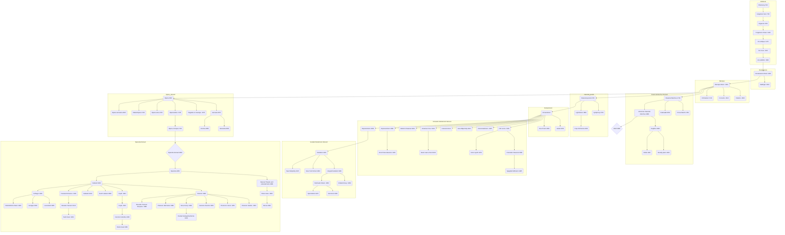

```mermaid
flowchart TD

subgraph Medieval

A(Plainsong. 500) -->B(Gregorian Cant. 750)

B -->C(Organum. 850)

C -->D[Polyphonic Chant. 1000]

D -->E[Ars antiqua. 1170]

E-->F[Ars nova. 1310]

F-->G(Ars subtilior. 1380)

end

subgraph Renaissance

G-->I(Renaissance Music.1400)

I-->J(Madrigal. 1520)

end

subgraph Baroque

I-->L(Baroque Music. 1600)

L-->M(Oratorio. 1600)

L-->N(Concerto. 1610)

L-->LL(Orchestral. 1720)

end

subgraph Classical Marches Derived

L-->LA(Classical Marches.1700)-->LB(Circus March.1780)

LA-->LC(Cakewalk.1850)

LA-->LD(American Classical Marches.1880)

LD-->LE(Ragtime.1890)-->LF(Novelty piano.1920)

LE-->LG(Stride.1921)

end

LD-->LH{JAZZ.1880}

subgraph classical_period

L-->GA(Classical period.1750)-->GB(Symphony.1759)

GA-->GC(Light Music 1850)-->GD(Pops Orchestra.1900)

end

subgraph Romanticism

GA-->HA(Romanticism)

HA-->HC(Lieder.1850)

HA-->HB(Tone Poem.1850)

end


subgraph Romantic Modernism Derived

HA-->JA(Film score. 1930)-->JAA(Cinematic Classical 1958)-->JAB(Spaghetti WEstern 1965)

JA-->FF(horror synth 1979)


HA-->HDA(Neoromanticism. 1925)

HA-->HDB(New Objectivity.1920)

HA-->HDC(Futurism.1910)

HA-->HDD(American Five. 1900)-->HDDA(West coast school 1930)

HA-->HDE(Modern Classical 1900)

HA-->HDF(Impressionism 1890)-->HDFA(French Neoclassical. 1915)

HA-->HDG(Expresionism 1908)

end


subgraph Serialist Modernism Derived

HDG-->IAA(Serialism.1920)

IAA-->IAB(Integral Serialism 1950)-->IAC(Indeterminacy. 1950)

IAB-->IAD(Stochastic Music. 1950)-->IAE(Sonorism 1960)

IAD-->IAF(Spectralism.1970)

IAA-->IAG(New York School 1950)

IAA-->IAH(New Simplicity 1970)

end

subgraph Opera_derived

L-->P(Opera.1600)

P-->PP(zarzuela.1657)-->PQQP(Sarswela.1880)

PP-->PQP(Revista.1865)

P-->PPP(Tragedie en musique. 1673)

P-->PPPP(Opera buffa. 1706)

PPPP-->PA(Opera comique.1715)


P-->PPPPP(Opera seria.1720)

P-->PPPPPP(Ballad Opera.1728)

P-->PPPPPPP(Opera semiseria.1820)

end


subgraph Operetta Derived

PA-->PB{Operetta derived.1850}-->PC(Operetta.1850)-->PD(Musical Theatre and entertainment.1866)-->PE(Show tunes. 1866)-->PF(Revue.1894)

PC-->PCC(Cabaret 1880)

PCC-->PCCA(chanson 1880)

PCCA-->PCCB(Chanson réaliste. 1950)

PCCA-->PCCC(Chanson á texte. 1950)

PCCA-->PCCD(Canzone d'autore 1958)

PCCA-->PCCE(Nova Canço 1962)-->PCCEE(Euskal Kantagintza Berria 1961)

PCCA-->PCCF(Chanson alternative 1988)

PCCA-->PCCG(Nouvelle chanson française. 1988)


PCC-->PDA(Cuplé. 1893)-->PDAA(Copla. 1920)-->PDAB(Cancion melodica 1930)-->PDAC(Bolero beat 1969)

PCC-->PDB(Dutch cabaret 1895)

PCC-->PDC(Kabarett.1901)

PCC-->PDD(Russian Romance. 1840)-->PDDA(Russian chanson 1910)-->PDDB(Bard music 1964)

PCC-->PDE(Schlager 1930)

PDE-->PDF(Levenslied 1955)

PDE-->PDG(Humppa 1958)

PDE-->PDH(Volsktümliche Music 1960)

end
```
